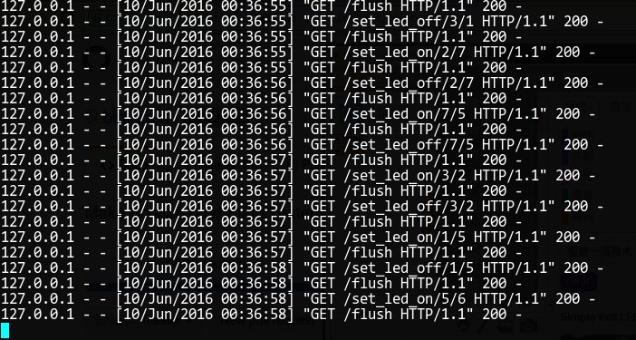
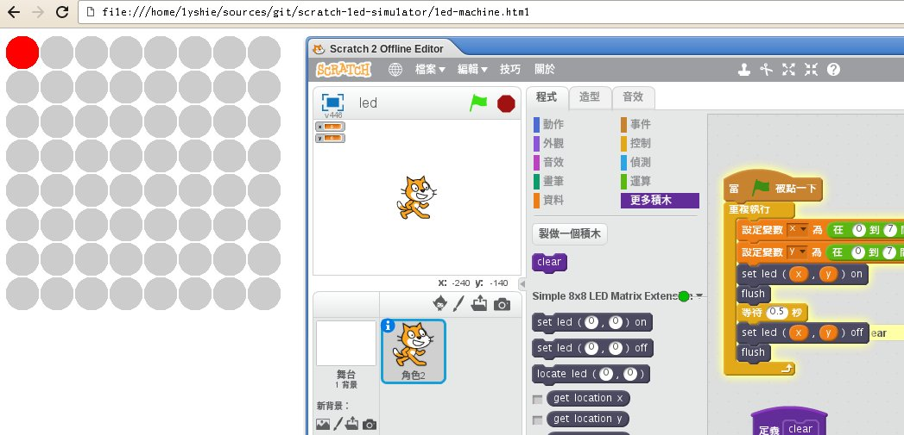
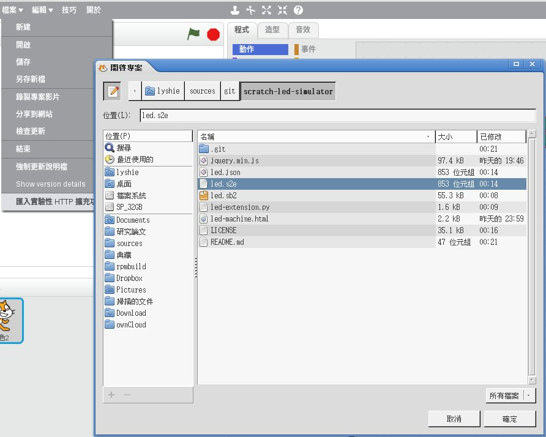
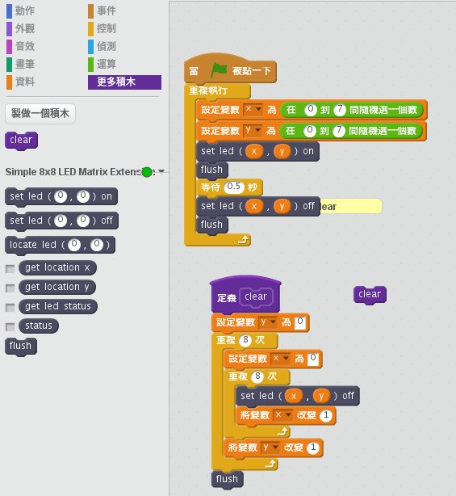

# scratch-led-simulator
Scratch2 LED Simulator

### 1. Create your own Scratch2 extension
* `led-extension.py` (using [blockext](https://github.com/blockext/blockext))

    `# python led-extension.py`
    

### 2. Setup LED Matrix simulator
* Launch your web browser and open `led-machine.html`

### 3. Import extension
* Import `led.s2e` extension, create your Scratch2 project (sample project `led.sb2`).

### 4. Reference
- [Scratch Extension](https://wiki.scratch.mit.edu/wiki/Scratch_Extension)
- [Creating Scratch 2.0 Extensions](https://wiki.scratch.mit.edu/w/images/ExtensionsDoc.HTTP-9-11.pdf)
- [Double buffering with HTML 5 Canvas](http://blog.bob.sh/2012/12/double-buffering-with-html-5-canvas.html)
